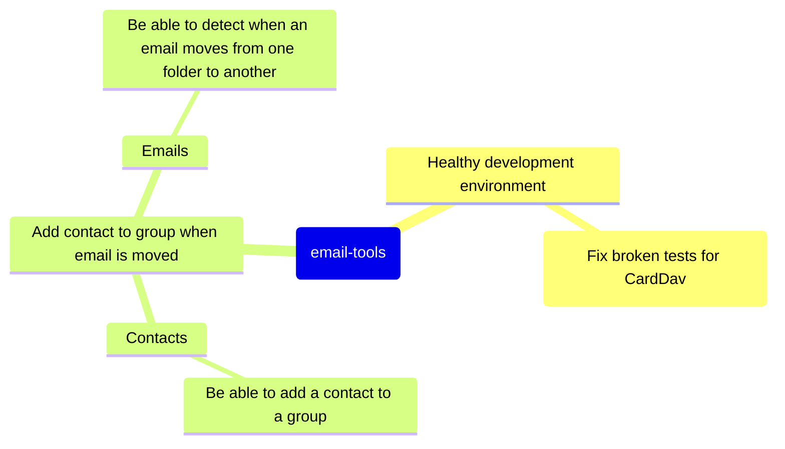

# To do

```mermaid
mindmap
	root(email-tools)
		Healthy development environment
			id(Fix broken tests for CardDav)
		Add contact to group when email is moved
			Contacts
				Be able to add a contact to a group
			Emails
				Be able to detect when an email moves from one folder to another
```